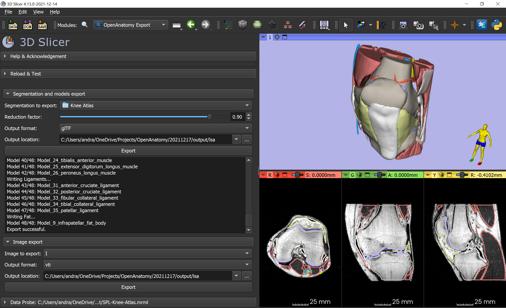

# SlicerOpenAnatomy

3D Slicer extension for exporting Slicer scenes to use in the [OpenAnatomy.org](https://www.openanatomy.org/) browser and glTF and OBJ file viewers.

## OpenAnatomy Export module

This module exports a model hierarchy or segmentation node from 3D Slicer into a single glTF or OBJ file, including all the model colors and opacities; and for glTF also model hierarchy and model names.



## Quick start

- Install `3D Slicer` and the `SlicerOpenAnatomy` extension
- Create/edit a segmentation using `Segment Editor` module
- Export the segmentation to glTF file using `OpenAnatomy Export` module
- Upload your model to Dropbox or GitHub and get a download link
- Create a view link by prepending `https://3dviewer.net/#model=` to the download link. The model can be viewed in 3D in the web browser on computers, tablets, and phones.

Example view link: https://3dviewer.net/#model=https://www.dropbox.com/s/38arwo2uhzu0ydg/SPL-Abdominal-Atlas.gltf?dl=0

## glTF viewers

- Online (in web browser):
  - [3dviewer.net](https://3dviewer.net/): simple, easy-to-use viewer
    - Free, open-source project ([GitHub page](https://github.com/kovacsv/Online3DViewer))
    - Model hierarchy can be viewed as a tree, entire branch can be shown/hidden
    - Model can be picked by clicking on an object in the 3D view
    - Orbit and free rotation
    - No editing of material or lighting
    - Can open a URL and can be embedded into an iframe
  - [gltfviewer.com](https://www.gltfviewer.com/): more complex viewer, for advanced viewing and editing
    - Allows material and light editing and saving of modified glTF file
    - Shows nodes and meshes separately
    - Model hierarchy can be viewed as a tree, entire branch can be shown/hidden
    - Model can be picked by clicking on an object in the 3D view. Limitation: the item must be visible in the tree (branch must be expanded).
    - Search by name
  - [Sketchfab](https://sketchfab.com/): commercial project, allows sharing with password, advanced lighting and other rendering settings, virtual reality.
- Android phones:
  - [OpenCascade CAD assistant](https://play.google.com/store/apps/details?id=org.opencascade.cadassistant):
    - Free application
    - Model hierarchy can be viewed as a tree, entire branch can be shown/hidden
    - Model can be picked by clicking on an object in the 3D view
    - Material and lighting editing

### Examples

Open a glTF files stored in a github repository:

https://3dviewer.net/#model=https://raw.githubusercontent.com/lassoan/Test/master/SPL-Abdominal-Atlas.gltf


Embed 3dviewer.net in a website:

```
<iframe width="640" height="480" style="border:1px solid #eeeeee;" 
src="https://3dviewer.net/embed.html#model=https://raw.githubusercontent.com/lassoan/Test/master/SPL-Abdominal-Atlas.gltf">
</iframe>
```

## Export options

- Segmentation to export: Select a segmentation or a subject hierarchy folder that contains models. If a folder is exported into glTF format then the folder hierarchy is preserved in the output file.
- Reduction factor: Amount of size reduction. Larger value means more reduction therefore smaller file. Factor of 0.95 means the size is reduced by 95% (output file size is 5% of the original file size).
- Output format
  - glTF: Export to glTF file format. Supported by many web viewers. Model names, hierarchy, color, and transparency information is preserved. Models that use Flat, Gouraud, or Phong interpolation in Slicer (see Models module / 3D display / Advanced) are converted to PBR interpolation during export (because glTF format uses PBR interpolation). Since these interpolation modes are not equivalent, the color and surface appearance will be slightly different in glTF viewers compared to what was shown in Slicer. For more accurate color correspondence, switch to PBR interpolation in Slicer (and it is recommended to enable `Image-based lighting` in `Lights` module in `SlicerSandbox` extension).
  - OBJ: Wavefront OBJ file format. Model color and transparency information is preserved.
  - scene: Export the models into the scene.
- Output location: folder where the output file will be written to. Filename is determined automatically from the selected segmentation or subject hierarchy folder node name.
