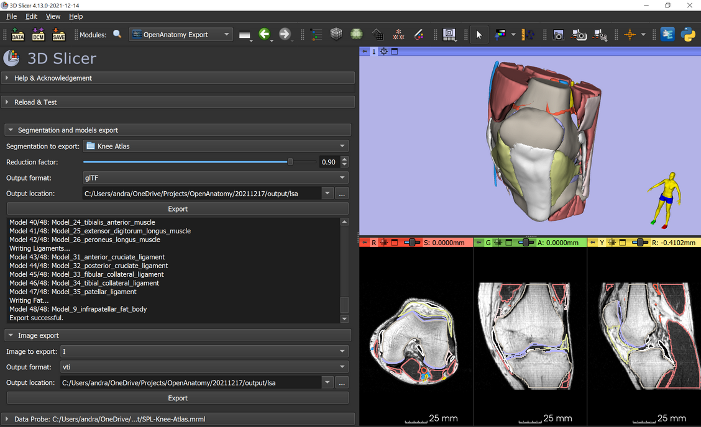
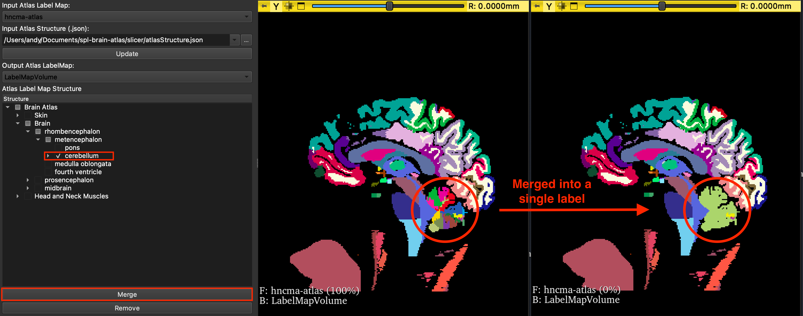

# Slicer Open Anatomy extension

Slicer Open Anatomy extension provides tools for loading, manipulating, exporting and visualizing the Open Anatomy Project's atlases in 3D Slicer.

<a href="https://www.openanatomy.org/">The Open Anatomy Project</a> aims to revolutionize the anatomy atlas by utilizing open data, fostering community-based collaborative development, and freely distributing medical knowledge. The project has several different digital anatomy atlases, including:
- Mauritanian Anatomy Laboratory Thoracic Atlas
- SPL/NAC Brain Atlas
- SPL Liver Atlas
- SPL Head and Neck Atlas
- SPL Inner Ear Atlas
- SPL Knee Atlas
- SPL Abdominal Atlas

## Modules
### [OpenAnatomy Export](OpenAnatomyExport/README.md)    
This module exports a model hierarchy or segmentation node from 3D Slicer into a single glTF or OBJ file, including all the model colors and opacities; and for glTF also model hierarchy and model names. [More details...](OpenAnatomyExport/README.md)
  

### [AtlasEditor](AtlasEditor/README.md)  
This module is for editing and simplifying Open Anatomy's atlases. Users can select and organize the structures/labels into groups that is most relevant to their particular field or area of study using a hierarchy JSON schema. [More details...](AtlasEditor/README.md)
  

## Installation
1. Install and open 3D Slicer (https://download.slicer.org).
2. Open the Extension Manager and download 'SlicerOpenAnatomy' extension.
3. Restart 3D Slicer.

## Acknowledgements
Andras Lasso (PerkLab, Queen's University)  
Csaba Pinter (PerkLab, Queen's University)  
Michael Halle (SPL, Harvard Medical School)  
Andy Huynh (ISML, The University of Western Australia)
