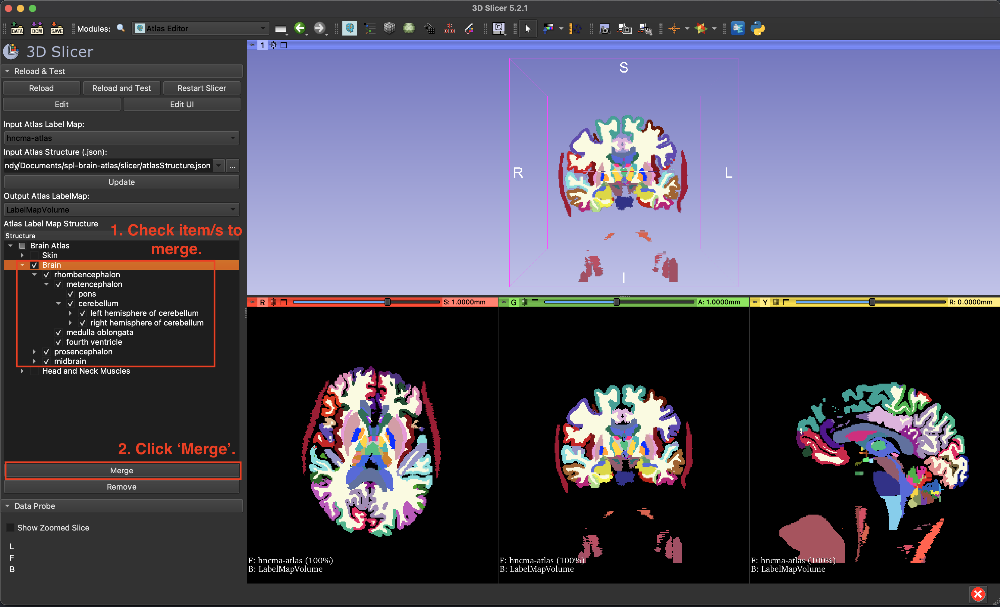
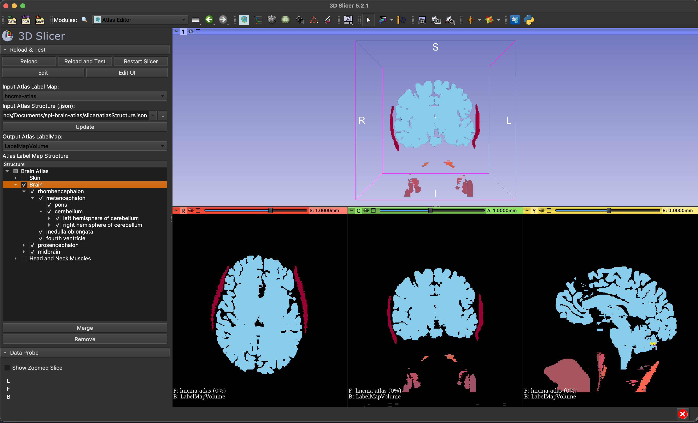

# Atlas Editor extension

This is a 3D Slicer extension for editing and simplifying The Open Anatomy Project's atlas labelmaps by anatomical groups.

<a href="https://www.openanatomy.org/">The Open Anatomy Project</a> aims to revolutionize the anatomy atlas by utilizing open data, fostering community-based collaborative development, and freely distributing medical knowledge. The project has several different digital anatomy atlases, including:
- Mauritanian Anatomy Laboratory Thoracic Atlas
- <a href="https://github.com/mhalle/spl-brain-atlas">SPL/NAC Brain Atlas</a> - :white_check_mark: (tested)
- SPL Liver Atlas
- SPL Head and Neck Atlas
- SPL Inner Ear Atlas
- SPL Knee Atlas
- SPL Abdominal Atlas

The Atlas Editor  extension is useful for editing and simplifying these comprehensive digital anatomy atlases for customization and tailoring of the atlas content to specific needs. Users can select and organize the structures/labels into groups that is most relevant to their particular field or area of study.

## Examples
### Merging
#### Merging entire brain:

#### Merging cerebellum:

### Removing
#### Removing skin, head and neck muscles:

## Installation

* Download and install a latest stable version of 3D Slicer (https://download.slicer.org).
* Start 3D Slicer application, open the Extension Manager (menu: View / Extension manager)
* Install AtlasEditor extension.

## Tutorial

* Start 3D Slicer
* Load an atlas labelmap: Add Data -> Colortable (e.g. hncma-atlas-lut.ctbl) -> OK -> Add Data -> Labelmap (e.g. hncma-atlas.nrrd) -> Check Show Options -> Check 'Label Map' -> Change colortable to the one imported -> OK
* Switch to "Atlas Editor" module
* Set 'Input Atlas Label Map' as the atlas label map imported.
* Set 'Input Atlas Structure (.json)' - available in Open Anatomy atlas repository (e.g. atlasStructure.json)
* Set 'Output Atlas Label Map' as 'Create a LabelMapVolume' or the imported atlas if you want to edit the original.
* Click 'Update' to show the hierachy tree structure from the json file.
* Check items that is to be merged or removed.
* Click 'Merge' or 'Remove'.

## Visualize and save results
* Open "Data" and turn on the visibility of the new labelmapvolume.
* Convert labelmap to segmentation node to edit/visualise further.

## For Developers
Open Anatomy's Atlas Browser   
https://github.com/mhalle/oabrowser/

SPL/NAC Brain Atlas   
https://github.com/mhalle/spl-brain-atlas

Atlas Structure Schema   
https://github.com/stity/mrmlToJson   
https://github.com/stity/atlas-schema

## Acknowledgments
This research was supported by an Australian Government Research Training Program (RTP) Scholarship.

The Open Anatomy Browser: A Collaborative Web-Based Viewer for Interoperable Anatomy Atlases, Halle M, Demeusy V, Kikinis R. Front Neuroinform. 2017 Mar 27;11:22. doi:10.3389/fninf.2017.00022.

## Contact

Please post any questions to the [Slicer Forum](https://discourse.slicer.org).

Andy Trung Huynh - andy.huynh@research.uwa.edu.au

## License
The code presented here is distributed under the Apache license (https://www.apache.org/licenses/LICENSE-2.0).