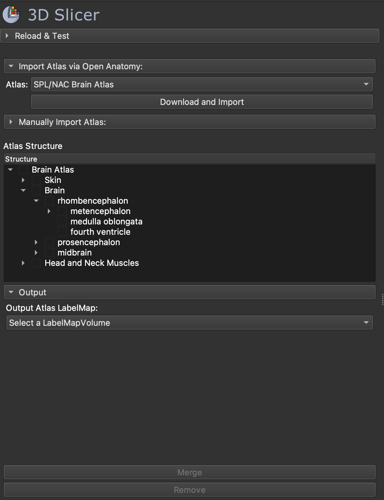

# SlicerAtlasEditor - Slicer Extension

### Notes
For reference - Open Anatomy's Atlas Browser
URL: https://github.com/mhalle/oabrowser/

Look at - how mike organised his tree structure in OABrowser:
1. Function parse() in https://github.com/mhalle/oabrowser/blob/master/src/ng-providers/atlasJsonProvider.js
2. Function dealWithAtlasStructure() in https://github.com/mhalle/oabrowser/blob/master/src/ng-providers/loadingManagerProvider.js

Look at - how rudolf bumm merged segments through pythonSlicer:
1. Function addSegmentToSegment() in https://github.com/rbumm/SlicerLungCTAnalyzer/blob/eca5aa39b7bd519954f3f1869de4d9210d582a69/LungCTSegmenter/LungCTSegmenter.py#L1535

Look at - how to use reusable segment editor functions in Slicer:
https://apidocs.slicer.org/master/classqMRMLSegmentEditorWidget.html

Look at - atlas structure schema:
1. https://github.com/stity/mrmlToJson
2. https://github.com/stity/atlas-schema

### Screenshot of Extension
